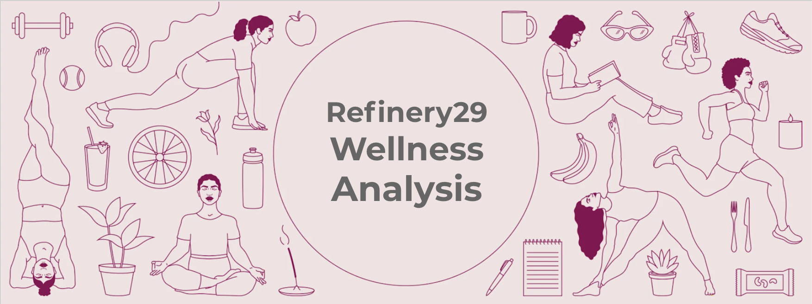
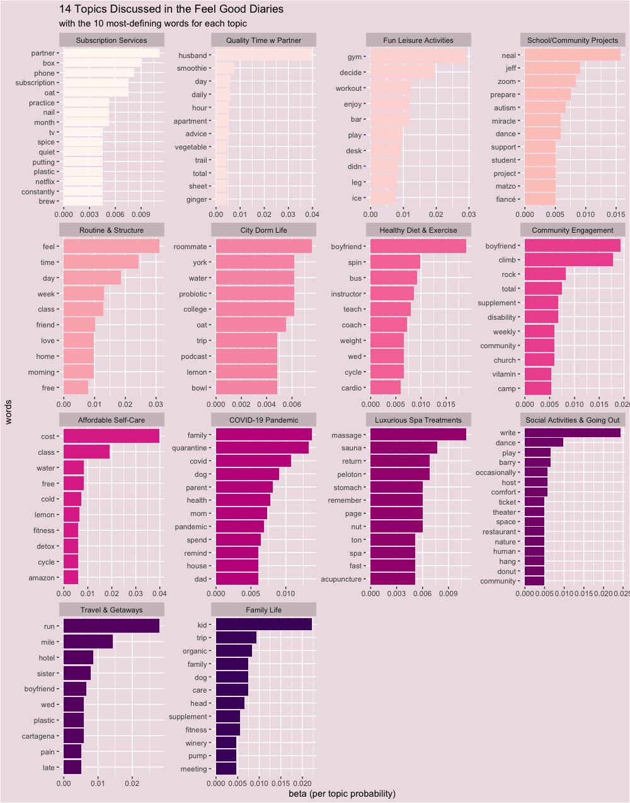
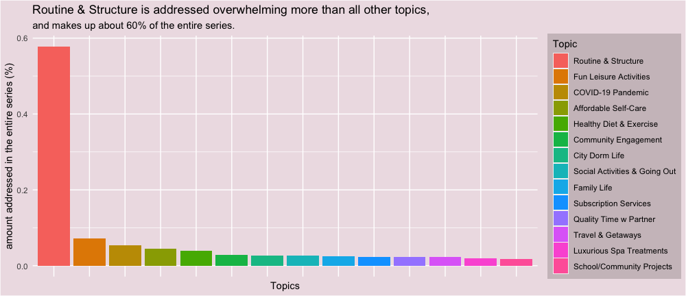
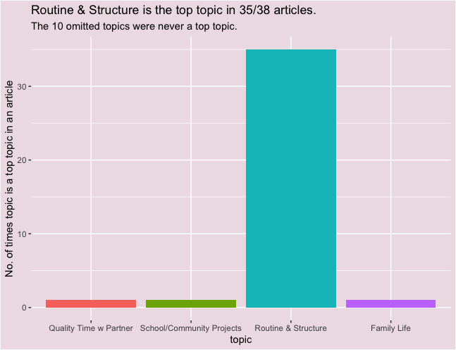

*(Note 6/4- This project is still in progress! Please check back for more updates.)*

## Research Question
* How has COVID-19 affected women's health and wellness habits?

## Sample
Text data was web-scraped from Refinery29's online publication series the [Feel Good Diaries](https://www.refinery29.com/en-us/feel-good-diaries?utm_source=facebook.com&utm_medium=adsales&utm_campaign=ES_VenusVeraBradley/Venus&fbclid=IwAR0dbdfif3nApRxN4nrqJI-e7I0wfNaGJliSVc5-hg7n-hjatc3_hrxyo_M), which chronicles women's health and wellness spending habits. There are 38 articles, all written by submission authors in the US and Canada, and published between January 2019 to May 2020. The 9 most recent articles were published during the COVID-19 pandemic. This project will be routinely updated to include new articles as more data. 

## Methods
* LDA (Latent Dirchlet Allocation) Topic Modeling
* Time series analysis

## Results

### Topic Modeling
After tuning the topic models, 14 topics had the best combination of low perplexity, low minimazation, high maximization, and high coherence scores. (These scores can be viewed as LDAtuning graphs in the 'www' file.) The 14 topics are:

* Subscription Services
* Quality Time with Partner
* Leisure Activities
* School/Community Projets
* Routine & Structure
* City Dorm Life
* Healthy Diet & Exercise
* Community Engagement
* Affordable Self-Care
* COVID-19 Pandemic
* Spa Treatments
* Social Activities & Going Out
* Travel & Getaways
* Family Life

Each topic was labelled after reviewing its 25 top defining terms. The following graph displays the 14 topics labelled with their 10 most defining terms. Beta scores represent the word per topic probabilities, meaning the likelihood the word would appear in the topic. The average *highest* beta score for these 14 topics is 0.0218, while the median is 0.0204. 

### Topic Summaries

Routine & Structure is the most discussed topic in the entire series. Each of the other topics are discussed less than 10% in the entire series. Noticeably, despite only 9 articles written during the COVID-19 Pandemic, the COVID-19 Pandemic is the third most discussed topic in the entire series. 

Only four topics occurred as the most discussed topic in any of the articles: Quality Time with Partner, School/Community Projects, Routine & Structure, and Family Life.  Routine & Structure is the top topic in 35/38 articles, while the other 3 only occurred as a top topic once.

### Time Series Analysis

## Discussion
