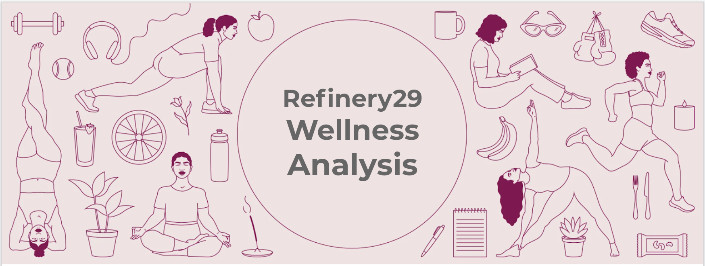

*(Note 5/29- This project is still in progress! Please check back for more updates.)*
## Research Question
* How has COVID-19 affected women's health and wellness habits?

## Sample
Text data was web-scraped from Refinery29's online publication series the 'Feel Good Diaries', which chronicles women's health and wellness spending habits. 

## Methods
* LDA (Latent Dirchlet Allocation) Topic Modeling

## Conclusions
Top 5 Topics Discussed in the Feel Good Diaries:

* Beverages
* Self-reflection
* Meal prep
* Daily routine
* Staying connected to family